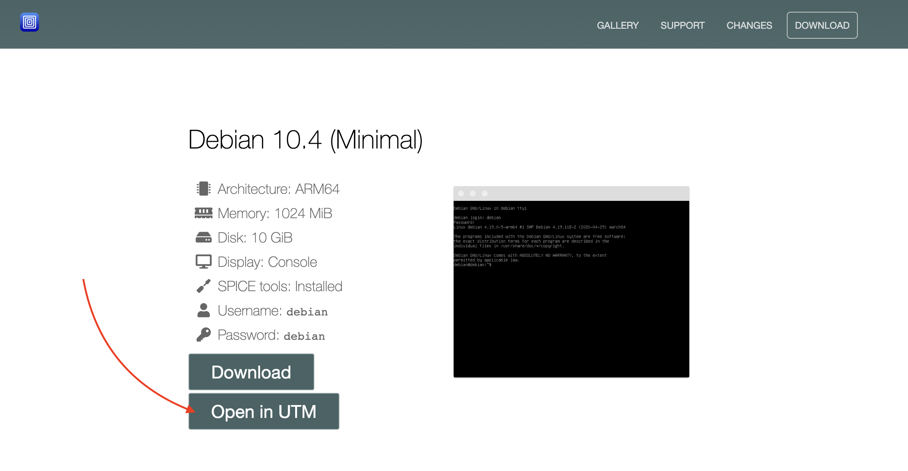
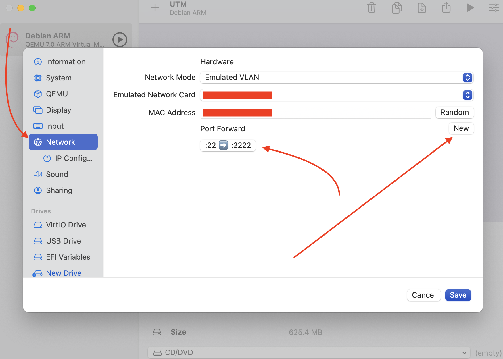

# QEMU

## Introduction

`qemu` configuration for Apple silicon Mac via [`UTM`](https://mac.getutm.app/)

## Contents

- [Usage](#usage)
- [TODO](#todo)

## Usage

```bash
brew install qemu
brew install --cask utm
```

- Go to https://mac.getutm.app/gallery/debian-10-4-minimal & click `Open in UTM`

- Let it download
- Before you start it, configure port forwarding for 22 guest -> 2222 host

- Start the machine
- ssh into it & log into root... then do whatever

```bash
ssh debian@127.0.0.1 -p 2222
# password == "debian"
sudo su -
```
## TODO

- create shell script to install a bunch of dependencies
